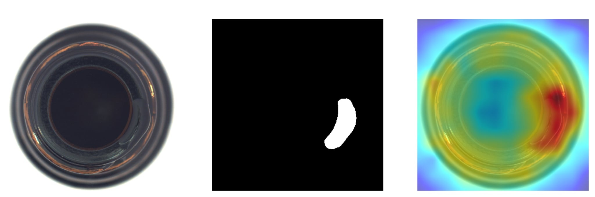
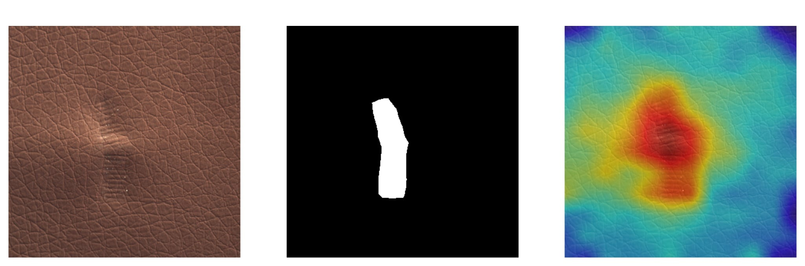
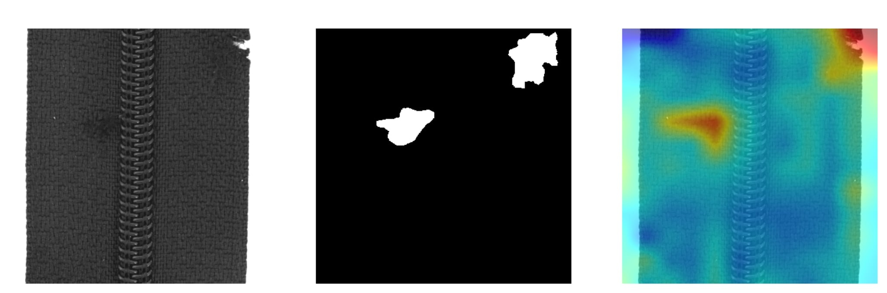

Implemented solutions in this project is based on:

Pankaj Mishra et al. "VT-ADL: A Vision Transformer Network for Image Anomaly Detection and Localization".

Wang et al. Attention-based deep learning for chip-surface-defect detection

Kakumani, Aruna et al. BRB U-Net: Bottleneck Residual Blocks in U-Net for Light-Weight Semantic Segmentation

Experiment result from VT-ADL:

